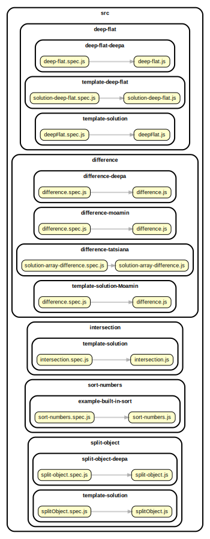

<!-- BEGIN TITLE -->

# DOCS

<!-- END TITLE -->

<!-- BEGIN TREE -->

> [interactive graph](./dependency-graph.html)



<!-- END TREE -->

<!-- BEGIN TOC -->

- deep-flat
  - template-deep-flat
    - [solution-deep-flat.js](#srcdeep-flattemplate-deep-flatsolution-deep-flatjs)
  - template-solution
    - [deepFlat.js](#srcdeep-flattemplate-solutiondeepFlatjs)
- difference
  - difference-moamin
    - [difference.js](#srcdifferencedifference-moamindifferencejs)
  - difference-tatsiana
    - [solution-array-difference.js](#srcdifferencedifference-tatsianasolution-array-differencejs)
  - template-solution-Moamin
    - [difference.js](#srcdifferencetemplate-solution-Moamindifferencejs)
- difference-firewyni
  - [difference.js](#srcdifference-firewynidifferencejs)
- intersection
  - intersection-firewyni
    - [intersection.js](#srcintersectionintersection-firewyniintersectionjs)
  - template-solution
    - [intersection.js](#srcintersectiontemplate-solutionintersectionjs)
- sort-numbers
  - example-built-in-sort
    - [sort-numbers.js](#srcsort-numbersexample-built-in-sortsort-numbersjs)
- split-object
  - split-object-deepa
    - [split-object.js](#srcsplit-objectsplit-object-deepasplit-objectjs)
  - template-solution
    - [splitObject.js](#srcsplit-objecttemplate-solutionsplitObjectjs)

---

<!-- END TOC -->

---

<!-- BEGIN DOCS -->

# /deep-flat

## /template-deep-flat

<details><summary><a href="../../src/deep-flat/template-deep-flat/solution-deep-flat.js" id="srcdeep-flattemplate-deep-flatsolution-deep-flatjs">../src/deep-flat/template-deep-flat/solution-deep-flat.js</a></summary>

<a name="deepFlat"></a>

## deepFlat ⇒ <code>Array</code>

Converts a nested array into a single array with no nesting.

It returns a new array and there are no side-effects.

**Returns**: <code>Array</code> - Returns the new flattened array.

| Param   | Type               | Default         | Description           |
| ------- | ------------------ | --------------- | --------------------- |
| [array] | <code>Array</code> | <code>[]</code> | The array to flatten. |

**Example**

```js
deepFlat([1, [2, [3, [4]], 5]]);
// -> [1, 2, 3, 4, 5]
```

**Example**

```js
deepFlat(["a", ["b", [["c"], ["d"]], "e"]]);
// -> ['a', 'b', 'c', 'd', 'e']
```

</details>

---

## /template-solution

<details><summary><a href="../../src/deep-flat/template-solution/deepFlat.js" id="srcdeep-flattemplate-solutiondeepFlatjs">../src/deep-flat/template-solution/deepFlat.js</a></summary>

<a name="deepFlat"></a>

## deepFlat ⇒ <code>Array</code>

Converts a nested array into a single array with no nesting

It returns a new array and there are no side-effects

**Returns**: <code>Array</code> - Returns the new flattened array.

| Param       | Type               | Default         | Description           |
| ----------- | ------------------ | --------------- | --------------------- |
| [testArray] | <code>Array</code> | <code>[]</code> | The array to flatten. |

</details>

---

---

# /difference

## /difference-moamin

<details><summary><a href="../../src/difference/difference-moamin/difference.js" id="srcdifferencedifference-moamindifferencejs">../src/difference/difference-moamin/difference.js</a></summary>

<a name="difference"></a>

## difference ⇒ <code>Array</code>

Creates an array of values that are in the first array, but not not in the second array.

Repeated values are not duplicated in the return value, and the order of result values are determined by the first array.

**Note:** This function returns a new array, and has no side-effects.

**Returns**: <code>Array</code> - Returns the new array of filtered values.

| Param    | Type               | Default         | Description            |
| -------- | ------------------ | --------------- | ---------------------- |
| [array]  | <code>Array</code> | <code>[]</code> | The array to inspect.  |
| [values] | <code>Array</code> | <code>[]</code> | The values to exclude. |

</details>

---

## /difference-tatsiana

<details><summary><a href="../../src/difference/difference-tatsiana/solution-array-difference.js" id="srcdifferencedifference-tatsianasolution-array-differencejs">../src/difference/difference-tatsiana/solution-array-difference.js</a></summary>

<a name="arrayDifference"></a>

## arrayDifference ⇒ <code>Array</code>

Write a function that removes specific values from an array.

Returns a new array without specific values.

Does not need to support: NaN, Infinity, -Infinity.

**Returns**: <code>Array</code> - Returns the new array of filtered values.

| Param    | Type               | Default         | Description            |
| -------- | ------------------ | --------------- | ---------------------- |
| [array]  | <code>Array</code> | <code>[]</code> | The array to inspect.  |
| [values] | <code>Array</code> | <code>[]</code> | The values to exclude. |

**Example**

```js
difference([2, 1], [2, 3]); //  [1]
```

**Example**

```js
difference([1, 2, 1], [2, 3]); //  [1]
```

</details>

---

## /template-solution-Moamin

<details><summary><a href="../../src/difference/template-solution-Moamin/difference.js" id="srcdifferencetemplate-solution-Moamindifferencejs">../src/difference/template-solution-Moamin/difference.js</a></summary>

<a name="difference"></a>

## difference ⇒ <code>Array</code>

Creates an array of values that are in the first array, but not not in the second array.

Repeated values are not duplicated in the return value, and the order of result values are determined by the first array.

**Note:** This function returns a new array, and has no side-effects.

**Returns**: <code>Array</code> - Returns the new array of filtered values.

| Param    | Type               | Default         | Description            |
| -------- | ------------------ | --------------- | ---------------------- |
| [array]  | <code>Array</code> | <code>[]</code> | The array to inspect.  |
| [values] | <code>Array</code> | <code>[]</code> | The values to exclude. |

**Example**

```js
difference([2, 1], [2, 3]); //  [1]
```

</details>

---

---

# /difference-firewyni

<details><summary><a href="../../src/difference-firewyni/difference.js" id="srcdifference-firewynidifferencejs">../src/difference-firewyni/difference.js</a></summary>

</details>

---

# /intersection

## /intersection-firewyni

<details><summary><a href="../../src/intersection/intersection-firewyni/intersection.js" id="srcintersectionintersection-firewyniintersectionjs">../src/intersection/intersection-firewyni/intersection.js</a></summary>

<a name="intersection"></a>

## intersection ⇒ <code>Array</code>

Creates an array of values that are in both the first and the second arrays.

Repeated values are not duplicated in the return value, and the order of result values are determined by the first array.

**Note:** This function returns a new array, and has no side-effects.

**Returns**: <code>Array</code> - Returns the new array of filtered values.

| Param    | Type               | Default         | Description            |
| -------- | ------------------ | --------------- | ---------------------- |
| [array]  | <code>Array</code> | <code>[]</code> | The array to inspect.  |
| [values] | <code>Array</code> | <code>[]</code> | The values to include. |

**Example**

```js
intersection([2, 1], [2, 3]);
// -> [2]
```

**Example**

```js
intersection([2, 1, 2], [2, 3]);
// -> [2]
```

</details>

---

## /template-solution

<details><summary><a href="../../src/intersection/template-solution/intersection.js" id="srcintersectiontemplate-solutionintersectionjs">../src/intersection/template-solution/intersection.js</a></summary>

<a name="intersection"></a>

## intersection ⇒ <code>Array</code>

Creates an array of values that are in both the first and the second arrays.

Repeated values are not duplicated in the return value, and the order of result values are determined by the first array.

**Note:** This function returns a new array, and has no side-effects.

**Returns**: <code>Array</code> - Returns the new array of filtered values.

| Param    | Type               | Default         | Description            |
| -------- | ------------------ | --------------- | ---------------------- |
| [array]  | <code>Array</code> | <code>[]</code> | The array to inspect.  |
| [values] | <code>Array</code> | <code>[]</code> | The values to include. |

**Example**

```js
intersection([2, 1], [2, 3]);
// -> [2]
```

**Example**

```js
intersection([2, 1, 2], [2, 3]);
// -> [2]
```

</details>

---

---

# /sort-numbers

## /example-built-in-sort

<details><summary><a href="../../src/sort-numbers/example-built-in-sort/sort-numbers.js" id="srcsort-numbersexample-built-in-sortsort-numbersjs">../src/sort-numbers/example-built-in-sort/sort-numbers.js</a></summary>

<a name="sortNumbers"></a>

## sortNumbers ⇒ <code>Array.&lt;number&gt;</code>

Sorts an array of numbers from smallest to largest.

Returns a new array without modifying the original array.

Does not need to support: NaN, Infinity, -Infinity.

**Returns**: <code>Array.&lt;number&gt;</code> - A new array with the same numbers, but sorted.

| Param          | Type                              | Default         | Description                   |
| -------------- | --------------------------------- | --------------- | ----------------------------- |
| [arrOfNumbers] | <code>Array.&lt;number&gt;</code> | <code>[]</code> | The array of numbers to sort. |

**Example**

```js
sortNumbers([1.5, 1, -1.5, 0, -1]);
// -> [-1.5, -1, 0, 1, 1.5]
```

**Example**

```js
sortNumbers([-1, 0, 1]);
// -> [-1, 0, 1]
```

</details>

---

---

# /split-object

## /split-object-deepa

<details><summary><a href="../../src/split-object/split-object-deepa/split-object.js" id="srcsplit-objectsplit-object-deepasplit-objectjs">../src/split-object/split-object-deepa/split-object.js</a></summary>

<a name="splitObject"></a>

## splitObject ⇒ <code>Array</code>

Splits an object into multiple objects with one key/value pair each.
The new objects are returned in an array.

This function has no side-effects, the argument object is not modified.

**Returns**: <code>Array</code> - Returns a new array with one entry for each key/value pair.

| Param        | Type                | Default         | Description                               |
| ------------ | ------------------- | --------------- | ----------------------------------------- |
| [toSeparate] | <code>object</code> | <code>{}</code> | The object to split into key/value pairs. |

**Example**

```js
splitObject({ a: 1, b: 2, c: 3 });
// -> [{ a: 1 }, { b: 2 }, { c: 3 }]
```

**Example**

```js
splitObject({ name: "robs", age: 25, tall: true, userName: "stor" });
// -> [{ name: 'robs }, { age: 25 }, { tall: true }, { userName: 'stor' }]
```

**Example**

```js
splitObject({});
// -> []
```

</details>

---

## /template-solution

<details><summary><a href="../../src/split-object/template-solution/splitObject.js" id="srcsplit-objecttemplate-solutionsplitObjectjs">../src/split-object/template-solution/splitObject.js</a></summary>

<a name="splitObject"></a>

## splitObject ⇒ <code>Array</code>

Splits an object into multiple objects with one key/value pair each.
The new objects are returned in an array.

This function has no side-effects, the argument object is not modified

**Returns**: <code>Array</code> - Returns a new array with one entry for each key/value pair.

| Param        | Type                | Default         | Description                               |
| ------------ | ------------------- | --------------- | ----------------------------------------- |
| [toSeparate] | <code>Object</code> | <code>{}</code> | The object to split into key/value pairs. |

**Example**

```js
splitObject({ a: 1, b: 2, c: 3 });
// -> [{ a: 1 }, { b: 2 }, { c: 3 }]
```

**Example**

```js
splitObject({ name: "robs", age: 25, tall: true, userName: "sbor" });
// -> [{ name: 'robs }, { age: 25 }, { tall: true }, { userName: 'sbor' }]
```

**Example**

```js
splitObject({});
// -> []
```

</details>

---

---

<!-- END DOCS -->
